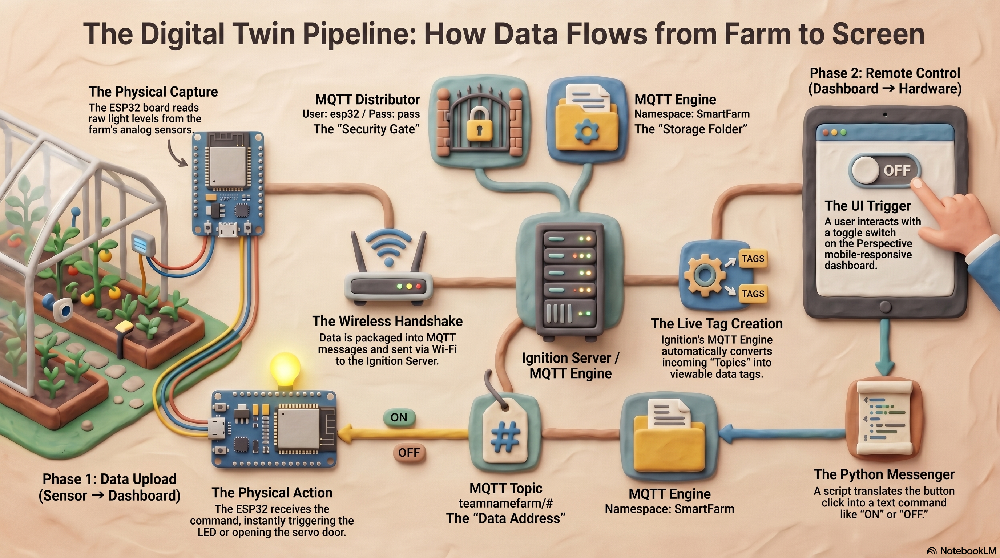
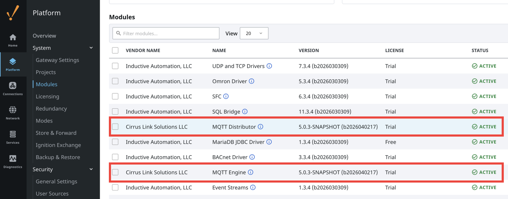
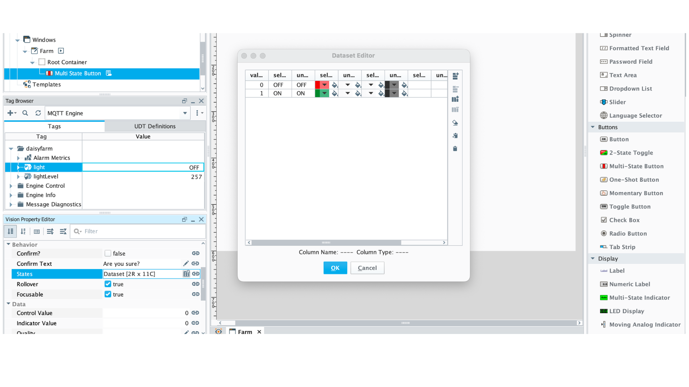
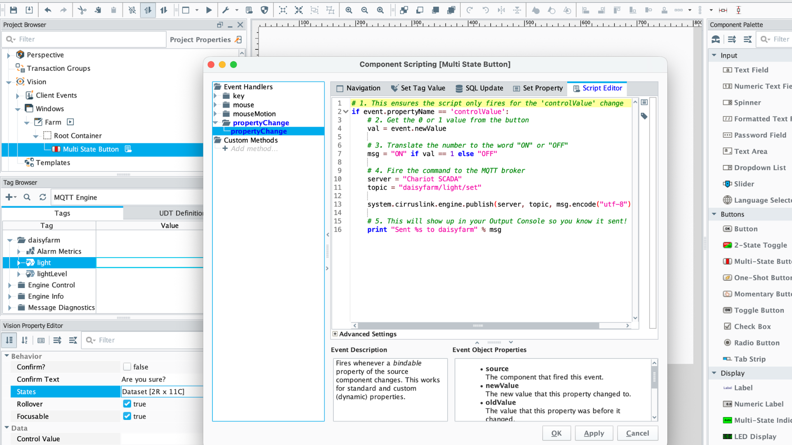

# 🚜 The Future Farmer's Guide to IoT: Building a Smart Farm

**Welcome, Engineer.**

This repository contains the code and instructions to build a **Digital Twin** of a Smart Farm. You are about to learn how to make a physical machine (a Smart Farm kit) talk to a powerful computer brain (a Server) over the invisible waves of the internet.

This is the exact same technology used by Tesla factories, Amazon warehouses, and vertical farming startups. By the end of this guide, *you* will know how to build it.

---

## 🧠 What You Will Learn
* **C++ Coding:** Writing the language that controls hardware.
* **Networking & IP:** How computers find each other in a crowded room.
* **MQTT:** The language machines use to whisper to each other across the world.
* **SCADA:** Building a "Mission Control" dashboard to monitor your farm from anywhere.



---

## 🛠 Phase 1: The Setup

Professional engineers spend 80% of their time fixing setup issues. If this part feels hard, it’s not because you’re bad at it—it’s because it *is* hard. Follow these steps to get your tools ready.

### 1. Install the Driver
**Install Driver for Windows:**
    * Follow the steps to Install the driver in the following link: 
    * https://docs.keyestudio.com/projects/KS0567/en/latest/wiki/Arduino/arduino.html#install-driver-for-keyestudio-esp32-plus-board

Your Mac needs a translator to speak to the chip on the farm kit.
* **Download:** Get the **CH340 Driver** (CH34xVCPDriver).
* **The Mac Fix:** 1. Run the installer package.
    2. Open the **CH34xVCPDriver** app in your Applications folder and click **Install**.
    3. Go to **System Settings > General > Login Items & Extensions**.
    4. Scroll to the bottom and click the **( i )** next to **Driver Extensions**.
    5. Toggle the **CH34xVCPDriver** to **ON**.
    6. **RESTART YOUR MAC.**
* **Verify:** Open Terminal and type `ls /dev/cu.wch*`. If you see `/dev/cu.wchusbserial...`, it works!

### 2. Prepare Arduino IDE
This is where we write the code for the physical board.
1.  Download **Arduino IDE 2.0**. or later `https://www.arduino.cc/en/software/`
2.  **Add the ESP32 Board Manager:**
    * Go to *Settings* (or Preferences).
    * Paste this link into "Additional Boards Manager URLs":
        `https://espressif.github.io/arduino-esp32/package_esp32_index.json`
3.  **Install the Board Package:**
    * Go to *Tools > Board > Boards Manager*.
    * Search for **ESP32** and install the package by *Espressif Systems*.
4.  **Install Libraries:**
    * Go to *Sketch > Include Library > Manage Libraries*.
    * Search for and install **PubSubClient** by Nick O'Leary.
    * (Optional) Install the library folder that came with your specific kit using *Add .ZIP Library*.

### 3. Prepare the Server (Ignition 8.3)

3.1. Install and Launch - IF YOU HAVE ALREADY DONE THIS, SKIP THIS PART
1.  **Download Ignition 8.3:** Choose the version for your computer (Intel/Apple Silicon for Mac; x64 for Windows).
2.  **Install:** Run the installer.
3.  **Launch:** Go to [http://localhost:8088](http://localhost:8088) in your browser.
4.  **Create User:** Set up an Admin account. **Write down your password!**

3.2. Install MQTT Modules
1.  **Download:** Use the [Cirrus Link Nightly Builds](https://docs.chariot.io/display/CLD83/Nightly+Module+Builds) to get **MQTT Distributor** and **MQTT Engine** (Version 5.x).
2.  **Go to Modules:** In the Ignition sidebar, click **Platform** > **System** > **Modules**.
3.  **Install:** Click the blue **Install or Upgrade Module +** button.
4.  **Upload:** Select your `.modl` files. Accept the license and certificate.
5.  **Check Status:** It will show **INACTIVE. PENDING RESTART**. This is expected!

3.3. Restart the Gateway (Required for 8.3)
You must manually restart the service to activate the new modules.

🍎 For macOS Users
1.  Open **Terminal** (Command + Space, type "Terminal").
2.  Navigate to the folder:  
    `cd /usr/local/ignition`
3.  Run the restart command:  
    `sudo ./ignition.sh restart`  
    *(Note: Type your Mac password when prompted; you won't see characters as you type.)*

🪟 For Windows Users
1.  Open **Command Prompt** as Administrator (Right-click > Run as Admin).
2.  Navigate to the folder:  
    `cd "C:\Program Files\Inductive Automation\Ignition"`
3.  Run the restart command:  
    `gwcmd.bat -r`

3.4. Final Verification
1.  Refresh your browser at [http://localhost:8088](http://localhost:8088).
2.  Go back to **Modules**.
3.  Confirm both MQTT modules show a solid green **ACTIVE** status.



---

## 🔌 Phase 2: The Hardware Hookup

### 1. Connect the Board
* Plug the ESP32 board into your computer.
* In Arduino IDE, go to *Tools > Port*. Select the USB port (e.g., `/dev/cu.usbserial...` or `COM3`).
* **Troubleshooting:** If you don't see the port, your cable might be "Charge Only." Swap it for a data cable.

### 2. The "Servo Trap" (⚠️ CRITICAL)
* **Before** building the wooden house, plug the Blue Servo Motor into the board.
    * View instructions here: `https://docs.keyestudio.com/projects/KS0567/en/latest/wiki/Arduino/arduino.html#set-the-angle-of-the-servo`
    * **Brown:** G (Ground)
    * **Red:** V (5V)
    * **Orange:** Pin 26
* Upload the basic servo code to move it to **180 degrees**.
* *Why?* If you don't do this, the motor might snap the plastic door when you turn it on later!

---
# Let do a all test
## 🛠️ Step 0: The Simple Hardware Test (Input & Output)

Before diving into Wi-Fi, MQTT, and Ignition, use this simple script to prove your physical wires are connected correctly and to understand how **Inputs** and **Outputs** work.

## 📝 The Code
Copy and paste this into a new Arduino Sketch:

```cpp
#define LED 27        // The Pin connected to the White LED
#define ButtonPin 5   // The Pin connected to the Button

void setup() {
  // OUTPUT: The Board sends electricity OUT to the LED
  pinMode(LED, OUTPUT);
  
  // INPUT: The Board waits for a signal to come IN from the Button
  pinMode(ButtonPin, INPUT);
}

void loop() {
  // If the Button is pressed (Reading 0/LOW in this kit)
  if (digitalRead(ButtonPin) == 0) {
    digitalWrite(LED, HIGH); // Send power to the LED (ON)
  } else {
    digitalWrite(LED, LOW);  // Cut power to the LED (OFF)
  }
}
```
## Did it work? If so, move on. If not, ask for help!
---

## 📡 Phase 3: The Code (The "Brain")

We need to create an MQTT User so the board is allowed to talk to the server.
1.  Go to `http://localhost:8088`.
2.  Navigate to **Connections > MQTT Distributor > Settings > Users**.
3.  Create a new user:
    * **Username:** `esp32`
    * **Password:** `pass`
    * **ACLs:** `RW #` (This creates a "Read/Write All" permission).
---
## 🏢 Phase 4: Setting up the Post Office (Ignition Gateway)

### 1. Create a Custom Namespace (The "Topic Catcher")
* In your Ignition Gateway, go to Connections > MQTT Engine >Settings.
* Click the Namespaces tab, then the Custom sub-tab.
* Click Create new Custom Namespace...
* Call it SmartKit.
* Name: SmartKit
* Subscription Topic: yourteam/# (e.g., teambfarm/#). - (This tells Ignition to listen to every message that starts with the word "teambfarm")
* Advanced: Check Create Writable Tags.
* Click Save Changes.

### The Master Sketch
Copy the code below into a new Arduino file. You must edit the top 3 lines to match your home network.

#🚨ATTENTION - YOU WILL NEED TO FIND AND REPLACE "farm" with your unique Subscription Topic e.g., teambfarm

```cpp
#include <WiFi.h>
#include <PubSubClient.h>
#include "esp_wifi.h"
#include "esp_wpa2.h"

// ==========================================
//      ⬇️ UPDATE THESE 4 LINES ⬇️
// ==========================================
const char* ssid = "YOUR_WIFI_NAME";        // Keep the quotes!
const char* username = "YOUR_USERNAME";   // Keep the quotes!
const char* password = "YOUR_WIFI_PASSWORD"; // Keep the quotes!
const char* mqtt_server = "172.16.x.x";   // Your Computer's IP Address

// --- CONFIGURATION ---
const char* mqtt_user = "esp32";
const char* mqtt_pass = "pass";

// --- PINS ---
#define ButtonPin 5
#define LED 27
#define PhotocellPin 34

// --- VARIABLES ---
int ledState = 0; 
unsigned long lastSensorTime = 0;
const long sensorInterval = 2000; // Read sensor every 2 seconds

WiFiClient espClient;
PubSubClient client(espClient);

// --- THE LISTENER (The Board's Ears) ---
void callback(char* topic, byte* payload, unsigned int length) {
  String message = "";
  for (int i = 0; i < length; i++) {
    message += (char)payload[i];
  }
  Serial.print("Ignition says: ");
  Serial.println(message);

  if (message == "ON") {
    ledState = 1;
    digitalWrite(LED, HIGH);
    client.publish("farm/light", "ON"); 
  } 
  else if (message == "OFF") {
    ledState = 0;
    digitalWrite(LED, LOW);
    client.publish("farm/light", "OFF"); 
  }
}

void setup() {
  Serial.begin(115200);
  
  // Setup Pins
  pinMode(ButtonPin, INPUT);
  pinMode(LED, OUTPUT);
  pinMode(PhotocellPin, INPUT);
  digitalWrite(LED, LOW); 

  // Network Setup
  setup_wifi();
  client.setServer(mqtt_server, 1883);
  client.setCallback(callback);
}

void loop() {
  if (!client.connected()) {
    reconnect();
  }
  client.loop();

  // TASK 1: CHECK PHYSICAL BUTTON (Instant)
  int ReadValue = digitalRead(ButtonPin);
  if (ReadValue == 0) {
    delay(10); 
    if (digitalRead(ButtonPin) == 0) {
      ledState = !ledState; 
      
      if(ledState) {
        digitalWrite(LED, HIGH);
        client.publish("farm/light", "ON"); 
      } else {
        digitalWrite(LED, LOW);
        client.publish("farm/light", "OFF");
      }
      while (digitalRead(ButtonPin) == 0); // Wait for release
    }
  }

  // TASK 2: READ SENSOR (Every 2 Seconds)
  unsigned long currentMillis = millis();
  if (currentMillis - lastSensorTime >= sensorInterval) {
    lastSensorTime = currentMillis; 
    
    int lightVal = analogRead(PhotocellPin);
    char msg[10];
    itoa(lightVal, msg, 10);
    
    client.publish("farm/lightLevel", msg);
  }
}

// --- NETWORK HELPERS ---
void setup_wifi() {
  delay(10);
  Serial.println("Connecting to WPA2 Enterprise WiFi...");
  Serial.print("Connecting to WiFi...");
  WiFi.disconnect(true);
  WiFi.mode(WIFI_STA);
  // Set WPA2 Enterprise credentials
  esp_wifi_sta_wpa2_ent_set_identity((uint8_t *)username, strlen(username));
  esp_wifi_sta_wpa2_ent_set_username((uint8_t *)username, strlen(username));
  esp_wifi_sta_wpa2_ent_set_password((uint8_t *)password, strlen(password));
  // Enable WPA2 Enterprise (NEW WAY)
  esp_wifi_sta_wpa2_ent_enable();

  WiFi.begin(ssid);
  while (WiFi.status() != WL_CONNECTED) {
    delay(500);
    Serial.print(".");
  }
  Serial.println("\nWiFi connected!");
  Serial.print("IP Address: ");
  Serial.println(WiFi.localIP());
}

void reconnect() {
  while (!client.connected()) {
    if (client.connect("ESP32Client", mqtt_user, mqtt_pass)) {
      Serial.println("Connected to Ignition");
      client.subscribe("farm/light/set"); // Subscribe to remote commands
      
      // Sync Light Status
      if(ledState) client.publish("farm/light", "ON");
      else client.publish("farm/light", "OFF");
      
    } else {
      delay(5000);
    }
  }
}
```
* Click the **Upload** arrow in Arduino IDE. 
* Open the **Serial Monitor** (magnifying glass) at **115200 baud** to ensure it says "Connected to Ignition".

---

## 🎨 Phase 5: Building the Digital Twin (Ignition Designer)
---
## Let's start with Vision
# Ignition Vision: Multi-State Button Setup Guide

This guide details the process of creating a manual toggle for the ESP32 light using a Multi-State Button in Ignition Vision.

## 1. Create the Component
1. **Open Designer**: Navigate to your Vision Window in the Project Browser.
2. **Drag & Drop**: From the **Component Palette** (right side), under the **Buttons** tab, drag the **Multi-State Button** onto your window.
3. **Configure States**: 
   - In the **Property Editor** (bottom left), find the **States** property.
   - Click the **Dataset Viewer** icon (small spreadsheet icon).
   - Ensure you only have **two rows** (delete any others):
     - **Row 0**: Value = `0`, Caption = `OFF`
     - **Row 1**: Value = `1`, Caption = `ON`
   - Click **OK**.


---

## 2. Add the Logic (Python Script)
1. **Right-Click** the button and select **Scripting**.
2. **Select Event**: On the left sidebar, go to **Property > propertyChange**.
   - *Note: Do not use 'actionPerformed' as it will cause propertyName errors.*
3. **Paste the Script**:



```python
# 1. This ensures the script only fires for the 'controlValue' change
if event.propertyName == 'controlValue':
    # 2. Get the 0 or 1 value from the button
    val = event.newValue
    
    # 3. Translate the number to the word "ON" or "OFF"
    msg = "ON" if val == 1 else "OFF"
    
    # 4. Fire the command to the MQTT broker
    # Ensure 'Chariot SCADA' matches your MQTT Engine server name exactly
    server = "Chariot SCADA"
    
    # STUDENT NOTE: "daisyfarm" is the unique namespace for this project. 
    # If you are setting up your own board, replace "daisyfarm" with 
    # your own unique name (e.g., "johnsfarms/light/set").
    topic = "daisyfarm/light/set"
    
    system.cirruslink.engine.publish(server, topic, msg.encode("utf-8"), 0, 0)
    
    # 5. Debug message to the Output Console (Tools > Console)
    print "Sent %s to %s" % (msg, topic)
```
---
## Doing the same thing in Perspective

### 1. Open Ignition Designer
* Launch the Designer and open your project.
* In the **Project Browser** (top left), right-click on **Perspective > Views** and select **New View**. 
* Name it `Dashboard`.

### 2. Display the Light Sensor (Data Coming IN)
* Look at the **Tag Browser** panel (bottom left).
* Drill down into the folders the Engine automatically created: `MQTT Engine > Edge Nodes > farm`.
* Drag the **lightLevel** tag onto your blank dashboard canvas and select **Label**.
* *You now have a live number on your screen.*

### 3. Control the LED (Data Going OUT)
Because the physical board expects the literal text words "ON" and "OFF", we use a Python translation script.
* Open the **Perspective Component Palette** and drag a **Toggle Switch** onto your canvas.
* Right-click the Toggle Switch and select **Configure Events**.
* Select **onActionPerformed**, click the **+** icon, and select **Script**.
* Paste this Python code:

```python
# 1. Get the status of the switch (True/False)
is_on = self.props.selected

# 2. Translate it to the text the Arduino expects
msg = "ON" if is_on else "OFF"

# 3. Fire the command directly to the local MQTT Post Office
# Note: "Chariot SCADA" is the default nickname of your local MQTT connection
system.cirruslink.engine.publish("Chariot SCADA", "farm/light/set", str(msg).encode("utf-8"), 0, 0)

```
* Click **OK**.

### 4. Test It!
* Click the **Play Button ▶️** at the top to enter Preview Mode.
* Click your Toggle Switch. Look at your physical farm. The LED should turn on and off instantly!

---

## 🚨 Quick Troubleshooting
* **Red Error when Saving:** Your 2-hour Gateway trial likely expired. Go to `http://localhost:8088`, click the green banner to reset the trial, and try saving again.
* **Tag says "String" instead of Number:** If you try to put `lightLevel` on a gauge component and it throws a Data Type error, use an Expression binding like `toInt({[MQTT Engine]Edge Nodes/farm/lightLevel})` to force it to read as a number.
